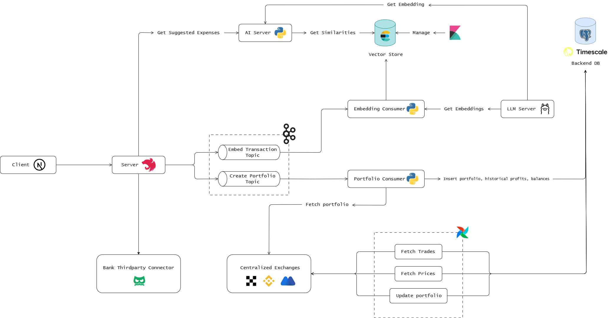

# Finance Management System

## Overview

Real-time cryptocurrency portfolio tracking system with automated data pipelines and analytics. Integrates with major exchanges (Binance, OKX, MEXC) via Airflow DAGs.

## Features

### Crypto Management
- Multi-exchange portfolio aggregation (Binance, OKX, MEXC)
- Real-time asset valuation
- Historical P&L analysis
- Automated trade synchronization

### Banking & Expenses
- Transaction monitoring across bank accounts
- Smart expense categorization
- Budget tracking with monthly targets
- Cash flow analysis
- AI-powered expense suggestions

## Tech Stack

**Frontend**: Nextjs + Apollo Client + Shadcn UI  
**Backend**: NestJS + GraphQL + PostgreSQL  
**Data Pipeline**: Apache Airflow + Python  
**Infra**: Docker

## Installation
