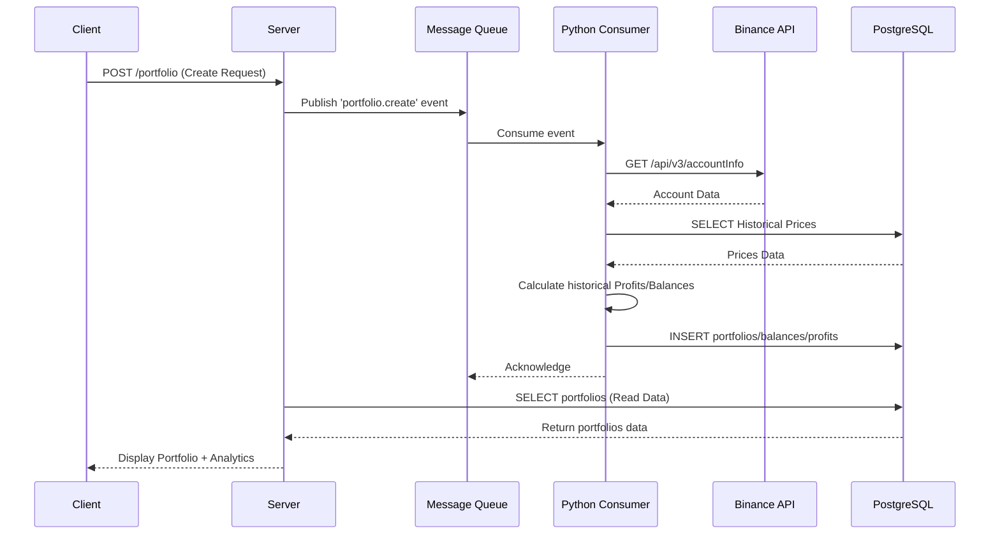

```mermaid
sequenceDiagram
    participant User as Client
    participant NestJS as Server
    participant Kafka as Message Queue
    participant Python as Python Consumer
    participant Binance as Binance API
    participant DB as PostgreSQL

    User->>NestJS: POST /portfolio (Create Request)
    NestJS->>Kafka: Publish 'portfolio.create' event
    Kafka->>Python: Consume event
    Python->>Binance: GET /api/v3/accountInfo
    Binance-->>Python: Account Data
    Python->>DB: SELECT Historical Prices
    DB-->>Python: Prices Data
    Python->>Python: Calculate historical Profits/Balances
    Python->>DB: INSERT portfolios/balances/profits
    Python-->>Kafka: Acknowledge
    NestJS->>DB: SELECT portfolios (Read Data)
    DB-->>NestJS: Return portfolios data
    NestJS-->>User: Display Portfolio + Analytics
```