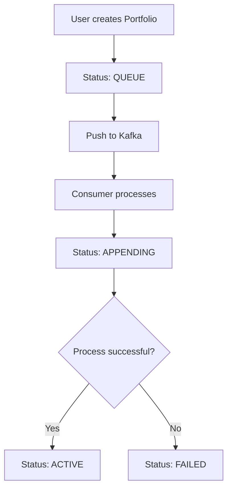

```mermaid
flowchart TD
    A[User creates Portfolio] --> B[Status: QUEUE]
    B --> C[Push to Kafka]
    C --> D[Consumer processes]
    D --> E[Status: APPENDING]
    E --> F{Process successful?}
    F -- Yes --> G[Status: ACTIVE]
    F -- No --> H[Status: FAILED]
```